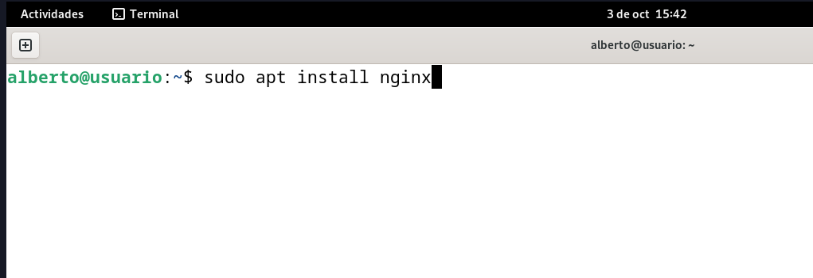
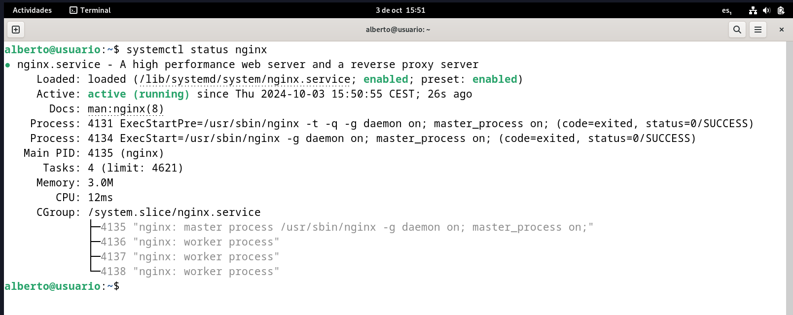
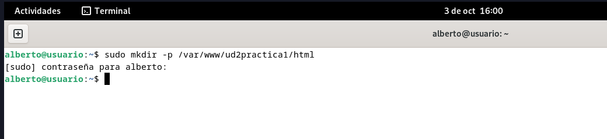
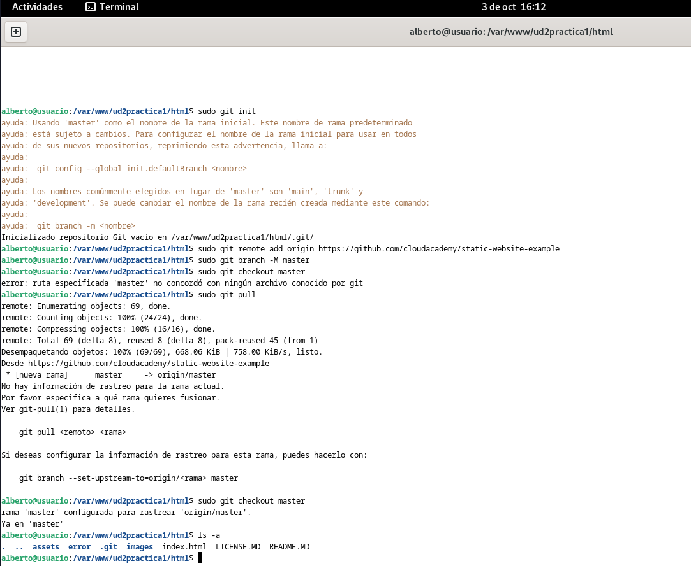
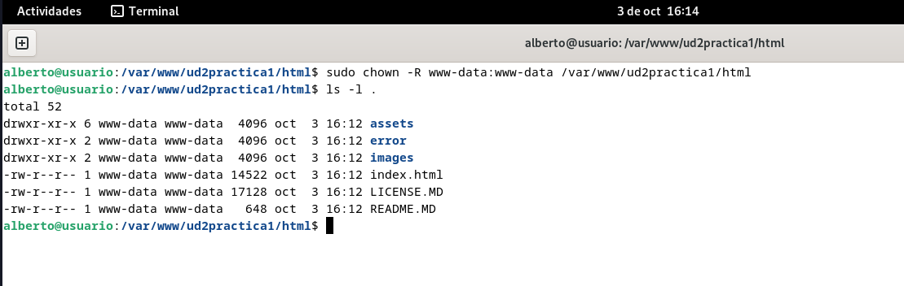
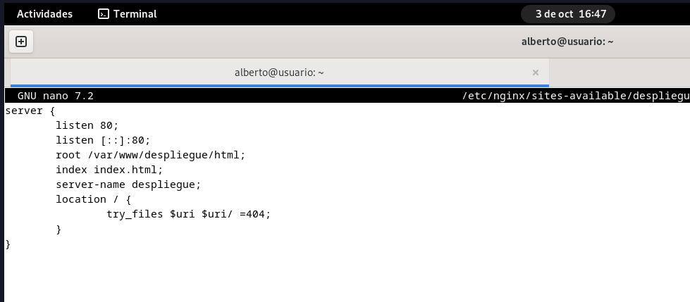
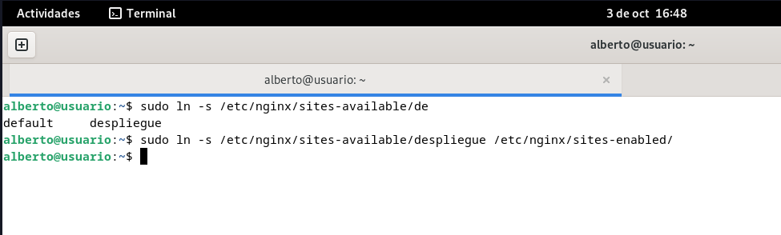
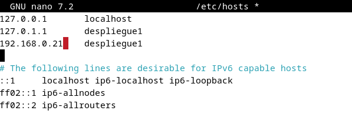
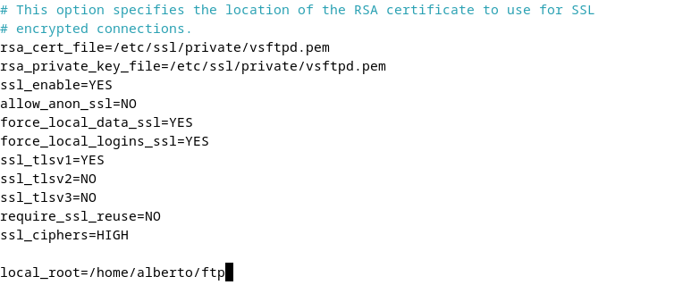

# Práctica 2.1

## Instalación de NGINX

Para instalar Nginx en nuestro equipo Debian, ejecutamos en la terminal:

```console
sudo apt install nginx
```




Si al hacer:
```console
systemctl status nginx
```

el servicio aparece como "failed", es posible que tengamos apache2 instalado y utilizando el puerto 80. En ese caso tendremos que, primero, parar el servicio de Apache con:
```console
systemctl stop apache2
```

Otra posibilidad es directamente desinstalar apache2 con:
```console
sudo apt remove apache2
```

y sólo después podremos inicializar el servicio de Nginx con:
```console
systemctl start nginx
```

Para comprobar el estado de Nginx, volvemos a ejecutar:
```console
systemctl status nginx
```




## Preparación de los directorios del sitio web

Primero, crearemos un directorio para nuestro sitio web:
```console
sudo mkdir -p /var/www/ud2practica1/html
```



En mi caso, he clonado un repositorio para una web estática de prueba para la página:



Y realizamos unos ajustes sobre la propiedad del directorio:
```console
sudo chown -R www-data:www-data /var/www/ud2practica1/html
sudo chmod -R 755 /var/www/ud2practica1/html
```




## Configuración del servidor

Para que Nginx presente el contenido del sitio, será necesario crear un archivo de configuración en /etc/nginx/sites-available/nombre-del-dominio, con el siguiente contenido:



A continuación tendremos que crear un enlace simbólico entre este archivo y el de los sitios habilitados en Nginx, ejecutando:

```console
sudo ln -s /etc/nginx/sites-available/despliegue /etc/nginx/sites-enabled/    // El nombre es distinto porque cambié el nombre de directorio a "despliegue"
```



Y reiniciamos Nginx con:
```console
systemctl restart nginx
```

Por último, añadiremos la IP de la máquina a la lista de hosts:




## Configurar SFTP

Para configurar el protocolo de transferencia de archivos, realizaremos las siguientes configuraciones desde el terminal:

```console
// Instalamos vsftpd
sudo apt-get install vsftpd

// Creamos un directorio en home
mkdir /home/alberto/ftp

// Creamos certificados de seguridad 
sudo openssl req -x509 -nodes -days 365 -newkey rsa:2048 -keyout/etc/ssl/private/vsftpd.pem -out /etc/ssl/private/vsftpd.pem
```

A continuación, modificaremos el archivo de configuración /etc/vsftpd.conf. Buscamos las líneas:
> rsa_cert_file=/etc/ssl/certs/ssl-cert-snakeoil.pem

> rsa_private_key_file=/etc/ssl/private/ssl-cert-snakeoil.key

> ssl_enable=NO

las borramos y escribimos en su lugar lo siguiente:



Tras lo que reiniciamos el servicio con:
```console
sudo systemctl restart --now vsftpd
```